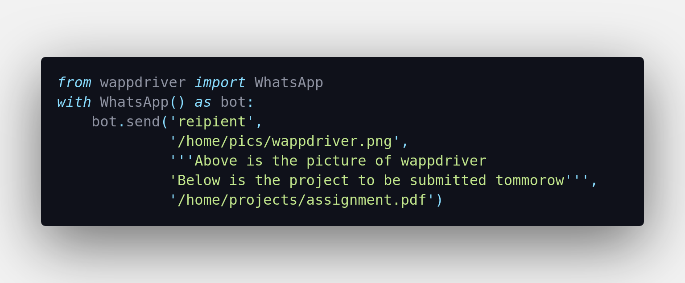

# Usage Documentation

[Readme](../README.md) | [Docs](Documentation.md) | [Concepts](concepts.md) | [Developer Guide](For_Developers.md) | [Help](help.md) 

This is a detailed usage documentation for using `wappdriver`. [README](https://aahnik.github.io/wappdriver) for introduction. 


- [Usage Documentation](#usage-documentation)
  - [First time Setup](#first-time-setup)
  - [Sending a Simple Message](#sending-a-simple-message)
  - [Images, Videos and Documents](#images-videos-and-documents)
  - [Sending Multiple Files](#sending-multiple-files)
  - [Messages with Files](#messages-with-files)
  - [Lazy/Exhausted bot](#lazyexhausted-bot)
  - [In Brief](#in-brief)

## First time Setup

There is no hassle in setting up `wappdriver`.
>Make sure you have matching versions of Chrome and Chrome Driver.
After you `pip install wappdriver`, you can directly run your code. 
- You will be prompted to enter the installation path of Chrome Driver Executable (only once). Just copy and paste the correct path there. 
- When you load WhatsApp for the first time, you have to scan the QR Code that will be displayed on your computer from your phone, to login into WhatsApp Web

## Sending a Simple Message

The code snippet below is enough to show you how.

.

## Images, Videos and Documents

With `wappdriver` its easy to do all these. Simply pass the path of the image or video or document file to the `send` method. 
- You must use absoulte file paths.
- File path must not have any space 
  
Note: 
- In Windows absolute paths looks like: 
    `C:\Users\mathew\img.png`
- While in Linux or Mac they look like:
    `/home/aahnik/img.png`

You can send any file type that WhatsApp supports.
> WhatsApp does not support files over 16 MB


## Sending Multiple Files 

You can easily pass as many arguments to `send` method of `WhatsApp` class you wish.
**Just remember that the first argument must be the name of the recipient.**


## Messages with Files

Hmm! `wappdriver` is extremely smart. It can detect whether a string is a message or a file path. So you can do this as shown below. Dont hesitate to use a multiline line string for a long message. 



The messages will be send in exactly that order.

## Lazy/Exhausted bot

todo 


## In Brief

Pass name of recipient as first argument and after that you can pass as many message arguments as you wish. 

- The name of recipient must be saved in your contacts.
- Each message argument must be a string. 
- If you want to send a file, pass the absolute path of the file to the function.
        
---
Example Use:

```python

with WhatsApp() as bot:
    bot.send('aahnik',  # name of recipient

            'hi send by a bot',  # message

            # absolute path of an image on computer
            '/home/aahnik/image.png',  

            # absolute path of a video on computer
            '/home/aahnik/video.mp4',  

            # absolute path of pdf on computer
            '/home/aahnik/django.pdf'  
            )
```


The first argument you need to pass is the recipient's name which must be saved in your phone.

After that you can pass as many string arguments you want for message. 
The string can be:
- a text message or 
- the file path if you want to send a image, video, GIF, documents etc.
- you can send multiple files, just pass them as arguments
- You must use Absolute File Paths
  
`wappdriver` will automatically detect whether a string is a message or a file path.

---

**If you are a developer and want to contribute code, read [Developer Guide](dev/wappdriver/index.html)**