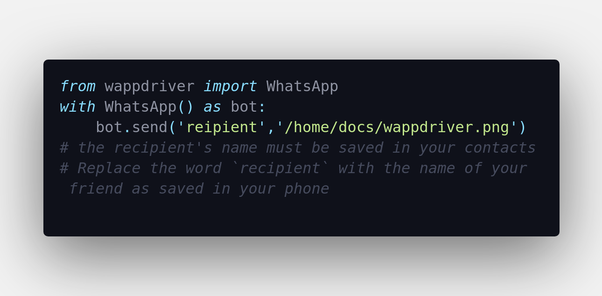

# Documentation

This is a detailed documentation of the functioning of `wappdriver`. [README](https://aahnik.github.io/wappdriver) for introduction.

- [Documentation](#documentation)
  - [First time Setup](#first-time-setup)
  - [Sending Images, Videos, Documents and other Files](#sending-images-videos-documents-and-other-files)
  - [Sending Multiple Files Together](#sending-multiple-files-together)
  - [Sending Messages with Files](#sending-messages-with-files)

## First time Setup

There is no hassle in setting up `wappdriver`.
>Make sure you have matching versions of Chrome and Chrome Driver.
After you `pip install wappdriver`, you can directly run your code. 
- You will be prompted to enter the installation path of Chrome Driver Executable (only once). Just copy and paste the correct path there. 
- When you load WhatsApp for the first time, you have to scan the QR Code that will be displayed on your computer from your phone, to login into WhatsApp Web

## Sending Images, Videos, Documents and other Files

With `wappdriver` its easy to do all these. Simply pass the path of the image or video or document file to the `send` method. 
- You must use absoulte file paths.
- File path must not have any space 
You can send any file type that WhatsApp supports.
> WhatsApp does not support files over 16 MB

## Sending Multiple Files Together

You can easily pass as many arguments to `send` method of `WhatsApp` class you wish.
**Just remember that the first argument must be the name of the recipient.**

## Sending Messages with Files

Hmm! `wappdriver` is extremely smart. It can detect whether a string is a message or a file path. So you can do this as shown below. Dont hesitate to use a multiline line string for a long message. 

The messages will be send in exactly that order.